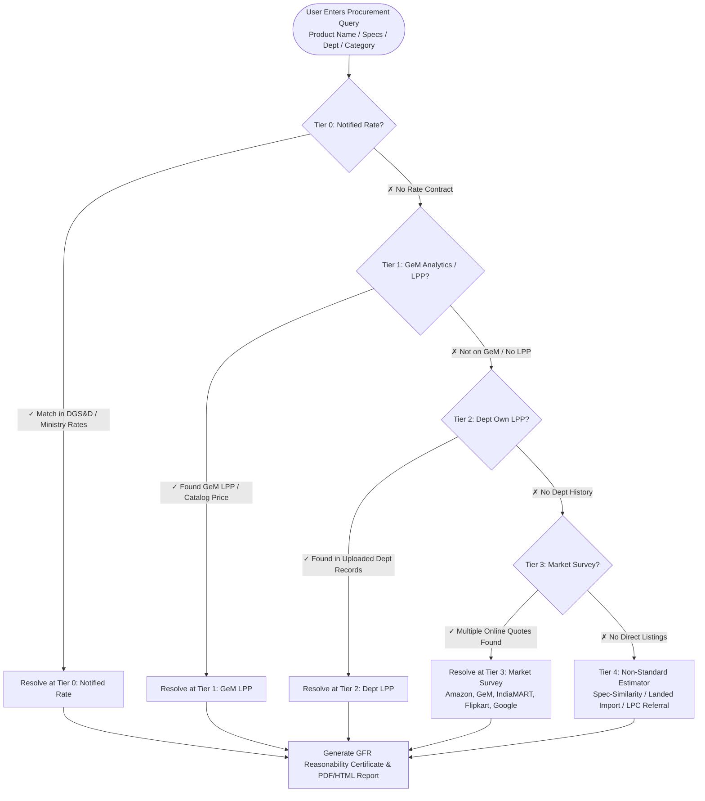

<div align="center">

<h1>◆ Onyx</h1>
<p><strong>AI-Powered Price Reasonability & Market Survey Platform for Public Procurement</strong></p>
<p><em>Compliant with General Financial Rules (GFR) 2017 Rule 149(vii), Rules 161–163 & the Manual for Procurement of Goods</em></p>

[](LICENSE)
[](https://www.python.org/)
[](https://fastapi.tiangolo.com/)
[%20%26%20161–163-059669.svg)](https://doe.gov.in)
[](tests/)

</div>

---

## 🏛️ What is Onyx?

**Onyx** is an automated price benchmarking and reasonability platform built for government departments, public sector units (PSUs), and procurement officers. It establishes legally defensible, audit-ready price reasonability by strictly executing the **GFR 2017 Rule 149(vii)** order of precedence:

1. **Tier 0 — Notified Rates & Rate Contracts**: Official DGS&D and Ministry-notified rates.
2. **Tier 1 — GeM Business Analytics & LPP**: GeM Last Purchase Price (LPP) and verified marketplace catalog listings.
3. **Tier 2 — Department's Own LPP**: Internal historical purchase data uploaded via CSV/Excel with fuzzy matching (`rapidfuzz`).
4. **Tier 3 — Multi-Source Online Market Survey**: Parallel real-time web surveys across GeM, Amazon India, IndiaMART, Flipkart, CPPP, and Google Shopping with automated outlier filtering and statistical confidence scoring.
5. **Tier 4 — Non-Standard Item Estimator**: Spec-similarity extrapolation, landed import cost modeling (AliExpress/Customs), and automated Local Purchase Committee (LPC) referral workflows for custom equipment (waveguides, antennae, SDRs, bespoke fabrications).

Onyx combines this procurement intelligence with a high-performance **underlying scraping, browser automation (Playwright), and anti-bot evasion engine (`curl-cffi`)**, and closes the loop with a **statutory compliance layer**: L1 reasonableness bands, procurement-threshold modes (Rules 161–163), canonical base-product identity, landed-cost freight, delegation workflows, and a compliance-complete certificate — all persisted and audit-trailed per benchmark run.

---

## ⚡ The 5-Tier Waterfall Architecture



---

## ✨ Key Features

| Capability | Description |
|---|---|
| ⚖️ **GFR 149(vii) Waterfall Engine** | Deterministic waterfall traversal prioritizing statutory rate contracts & GeM before market surveys. |
| 🎯 **L1 Competitive Bid & Reasonableness Band** | Compares against the **Lowest-1** of the valid competitive pool (not the median) with a ±25% band and an explicit within/outside verdict on the primary price. |
| 📏 **Procurement Threshold Compliance** | Estimated value maps to the statutory mode — Direct Purchase (Rule 161), Limited Tender (Rule 162), Open Competitive Bidding (Rule 163) — with a live compliant/non-compliant banner and remedial guidance. |
| 🧬 **Golden Parameters & Base-Product Identity** | Evidence scored for spec-overlap against declared golden params; naming variants collapse onto a canonical base product fuzzy-matched against the department's own purchase records (row-level isolation). |
| 🚚 **Landed-Cost Freight** | Delivery location drives a freight estimate (Metro 0.6%, inter-state 1.2%, North-East 2.2%, island sea-freight 4.5%); Goods + Freight = Landed total on the certificate. |
| 🧑‍⚖️ **Delegation & Review Trail** | Delegate a benchmark to another officer, Approve/Reject with notes, and keep an append-only audit log — a reproducible decision chain for the file. |
| 📜 **Compliance-Complete Certificate** | HTML & PDF certificates (ReportLab fallback) that document L1, band, threshold rule, golden params, base product, landed cost and the delegation/audit trail — every artifact matches the run, nothing re-computed later. |
| 📊 **Department LPP Ingestion** | Upload internal department procurement archives (CSV/Excel) with fuzzy semantic matching, 6%/yr inflation adjustment, and date weighting. |
| 🌐 **Parallel Market Survey Orchestrator** | Concurrently queries 6+ e-marketplaces (GeM, Amazon, IndiaMART, Flipkart, CPPP, Google Shopping) using `asyncio.gather`, with outlier filtering and reliability scoring. |
| 📐 **Non-Standard Equipment Estimator** | Solves complex bespoke procurement (waveguides, microwave components, SDRs) via spec-similarity ratios and landed cost basis, with LPC referral. |
| 🖥️ **Officer Dashboard** | Run-history dashboard with drill-down detail (threshold banner, L1/band, golden params, base product, freight, delegations & audit) and CSV export. |
| 🕵️ **Stealth Browser Engine** | Built-in Playwright headless browser pool + `curl-cffi` TLS fingerprint impersonation for robust data extraction. |
| 🛡️ **SSRF & Security Isolation** | Async DNS validation blocks internal subnet access; JWT auth + row-level department isolation + API key header validation. |

---

## 🚀 Quick Start

```bash
git clone https://github.com/Tejas3479/onyx.git
cd onyx

# Create and activate virtual environment
python -m venv .venv
# On Windows:
.venv\Scripts\activate
# On Linux/macOS:
# source .venv/bin/activate

# Install dependencies and Playwright browser binaries
pip install -r requirements.txt
playwright install chromium

# Launch the server (seeds reference data automatically on startup)
uvicorn app:app --host 0.0.0.0 --port 8000 --reload
```

- **Landing / Compliance Showcase:** `http://localhost:8000/`
- **Price Benchmark UI:** `http://localhost:8000/benchmark.html`
- **Officer Dashboard (Run History):** `http://localhost:8000/dashboard.html`
- **Department LPP Upload:** `http://localhost:8000/upload_history.html`
- **Profile & Delegations:** `http://localhost:8000/profile.html`
- **Interactive API Docs (Swagger):** `http://localhost:8000/docs`

---

## 📡 API Reference Overview

See [docs/API.md](docs/API.md) for full request/response schemas and examples.

### Core Procurement & Benchmark Endpoints

| Method | Endpoint | Description |
|---|---|---|
| `POST` | `/api/v1/benchmark` | Execute 5-tier GFR waterfall price reasonability check |
| `POST` | `/api/v1/estimate/non-standard` | Dedicated Tier 4 estimator for custom/uncommon items |
| `POST` | `/api/v1/department-lpp/upload` | Upload Department LPP records (CSV / XLSX) |
| `GET` | `/api/v1/department-lpp` | Query uploaded department purchase history |
| `GET` | `/api/v1/price-history` | List benchmark runs (with tier, price, stats, threshold) |
| `GET` | `/api/v1/price-history/{search_id}` | Full detail for a single benchmark run |
| `POST` | `/api/v1/delegations` | Delegate a benchmark to another officer for review |
| `GET` | `/api/v1/delegations` | List delegations for a search / officer |
| `POST` | `/api/v1/delegations/{id}/resolve` | Approve or Reject a delegation with a note |
| `GET` | `/api/v1/audit` | Append-only audit trail for a benchmark run |
| `POST` | `/api/v1/reports/generate` | Generate HTML/PDF report (incl. compliance certificate) for a persisted run |
| `POST` | `/api/v1/reports/generate-from-query` | Generate official GFR HTML/PDF Reasonability Report from a fresh query |
| `POST` | `/auth/register` | Register procurement officer account |
| `POST` | `/auth/login` | Login and receive JWT access token |
| `POST` | `/auth/demo-login` | One-click demo officer login (demo mode) |
| `GET` | `/auth/me` | Fetch the authenticated officer's profile |

### Scraping & Browser Automation Endpoints

| Method | Endpoint | Description |
|---|---|---|
| `POST` | `/fetch` | Direct fetch with TLS impersonation or Playwright JS rendering |
| `GET` | `/api/sessions` | Inspect active persistent browser sessions |
| `GET` | `/api/health` | System health check (No auth required) |

---

## 🧪 Example API Query

### Run Price Benchmark

```bash
curl -X POST http://localhost:8000/api/v1/benchmark \
  -H "Content-Type: application/json" \
  -d '{
    "product_name": "HP ProBook 450",
    "query_mode": "product",
    "department": "Ministry of Electronics & IT",
    "category": "IT Equipment",
    "quantity": 5
  }'
```

### Example Response (Tier 1 Match)

```json
{
  "search_id": "7f8b9a1c-3e2d-4f1a-b5c6-d7e8f9a0b1c2",
  "query": "HP ProBook 450",
  "query_mode": "product",
  "status": "completed",
  "resolved_tier": 1,
  "tier_label": "GeM Business Analytics",
  "primary_result": {
    "tier": 1,
    "tier_label": "GeM Business Analytics",
    "source_name": "GeM Last Purchase Price",
    "price": 71500.0,
    "currency": "INR",
    "confidence": "HIGH",
    "reliability": "HIGH",
    "evidence_url": "https://mkp.gem.gov.in/laptops/hp-probook-450-g10/p-5123456",
    "rationale": "GeM Last Purchase Price for 'HP ProBook 450 G10 Notebook PC'. Match score: 100%."
  },
  "tier_trace": {
    "tier_0": "No matching active notified rate found",
    "tier_1": "Found: GeM Last Purchase Price (₹71,500.00)"
  },
  "statistics": {
    "min": 71500.0,
    "max": 74200.0,
    "avg": 72850.0,
    "median": 72850.0,
    "count": 2
  },
  "sources_checked": 2,
  "results_found": 2
}
```

---

## 🏛️ GFR 2017 Rule 149(vii) Compliance Matrix

| GFR Mandate | Onyx Implementation | Verification Mechanism |
|---|---|---|
| **1. Notified Rates / DGS&D** | `Tier 0` checks active ministry notified rate schedules. | Authority, contract number, and validity dates checked against DB. |
| **2. GeM Business Analytics / LPP** | `Tier 1` queries GeM LPP caches and verified catalog endpoints. | GeM Product ID, seller identification, and transaction history. |
| **3. Department LPP** | `Tier 2` inspects uploaded historical department orders. | Semantic text + spec similarity scoring (`rapidfuzz`). |
| **4. Market Survey** | `Tier 3` executes multi-marketplace parallel survey. | Interquartile outlier exclusion + reliability scoring. |
| **5. Non-Standard Items** | `Tier 4` performs spec-ratio extrapolation & landed import costing. | Rationale output with mandatory Local Purchase Committee referral. |
| **Rule 149(vii) L1 Reasonability** | Primary price compared against the Lowest-1 of the valid competitive pool with a ±25% band. | L1, competitive pool, band low/high and within/outside verdict persisted per run. |
| **Rule 161 – Direct Purchase** | Value ≤ ₹25,000 resolves to the direct-purchase mode. | Threshold mode, applicable rule, quotes required vs obtained, compliant flag, guidance. |
| **Rule 162 – Limited Tender** | ₹25,000 – ₹1,00,000 requires at least 3 quotes from a curated list. | Same threshold audit fields persisted and rendered on the certificate. |
| **Rule 163 – Open Bidding** | > ₹1,00,000 requires open competitive bidding. | Non-compliance surfaced as an immediate banner on the dashboard. |
| **Delegation & Audit Trail** | Benchmarks can be delegated, reviewed, approved/rejected with notes. | Append-only `BenchmarkAuditLog` + `DelegationRecord` chain per `search_id`. |

---

## 🛠️ Tech Stack

- **Backend Framework:** FastAPI, Uvicorn, SQLModel / SQLAlchemy, Pydantic v2
- **Data & Matching:** SQLite / PostgreSQL, `rapidfuzz`, `pandas`, `openpyxl`
- **Scraping Engine:** Playwright (Chromium), `curl-cffi` (HTTP/2 & TLS impersonation)
- **Reporting:** Jinja2, HTML5 Print Stylesheets / WeasyPrint, ReportLab (PDF fallback)
- **Frontend:** Vanilla JS (ES6+), GSA CALC Design System, Semantic CSS
- **Quality:** pytest + pytest-asyncio, `ruff`, `mypy`

---

## 🤝 Contributing

1. Fork the repository
2. Create a feature branch: `git checkout -b feat/your-feature`
3. Verify the suite: `pytest`, `ruff check .` and `mypy . --ignore-missing-imports`
4. Commit your changes: `git commit -m 'feat: add feature'`
5. Push to branch and open a Pull Request

---

## 📄 License

MIT License — see [LICENSE](LICENSE) for details.
