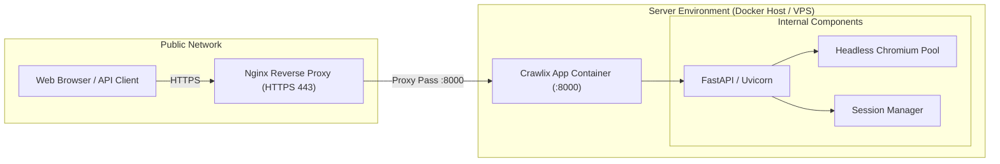

# Self-Hosting Guide

This guide covers running Crawlix on your own infrastructure — locally, with Docker, or on a VPS.

---

## 🏗️ Deployment Architecture



---

## Option 1: Docker (Recommended)

Docker is the easiest way to run Crawlix. It bundles Python, Playwright, Chromium, and all dependencies.

### Prerequisites
- [Docker](https://docs.docker.com/get-docker/)
- [Docker Compose](https://docs.docker.com/compose/install/)

### Steps

```bash
# 1. Clone the repo
git clone https://github.com/Tejas3479/crawlix.git
cd crawlix

# 2. Start the stack
API_KEYS=your-secret-key docker-compose up -d

# 3. Verify it's running
curl http://localhost:8000/health
# → {"status":"ok"}
```

### Using docker-compose.yml directly

Edit `docker-compose.yml` to set your config permanently:

```yaml
services:
  crawlix:
    image: crawlix:latest
    build: .
    ports:
      - "8000:8000"
    environment:
      - API_KEYS=key1,key2,key3
      - MAX_PLAYWRIGHT_INSTANCES=5
      - SESSION_TTL_MINUTES=60
      - MAX_SESSIONS=200
    restart: unless-stopped
```

Then:
```bash
docker-compose up -d --build
```

### Useful Docker commands

```bash
# View logs
docker logs crawlix_server -f

# Restart
docker restart crawlix_server

# Stop
docker-compose down

# Rebuild after code changes
docker-compose up -d --build
```

---

## Option 2: Local Python

### Prerequisites
- Python 3.11+
- pip

### Steps

```bash
# 1. Clone
git clone https://github.com/Tejas3479/crawlix.git
cd crawlix

# 2. Create virtual environment
python -m venv .venv

# Windows
.venv\Scripts\activate

# Linux / Mac
source .venv/bin/activate

# 3. Install dependencies
pip install -r requirements.txt

# 4. Install Playwright browser
playwright install chromium
playwright install-deps chromium   # Linux only

# 5. Set environment variables and run the API
$env:API_KEYS = "your-secret-key"           # Windows PowerShell
# export API_KEYS="your-secret-key"         # Linux/Mac

uvicorn app:app --host 0.0.0.0 --port 8000 --reload

# 6. In a separate terminal, ensure Redis is running and start the background worker:
$env:API_KEYS = "your-secret-key"
arq worker.WorkerSettings
```

Open http://localhost:8000 — the dashboard loads automatically.

---

## Option 3: VPS / Cloud VM

### Recommended specs
- 1 CPU, 2 GB RAM minimum (Playwright/Chromium is memory-hungry)
- 2 CPU, 4 GB RAM for production workloads

### Setup (Ubuntu 22.04)

```bash
# Install Python 3.11 and Redis
sudo apt update
sudo apt install -y python3.11 python3.11-venv python3-pip git redis-server

# Clone and install
git clone https://github.com/Tejas3479/crawlix.git
cd crawlix
python3.11 -m venv .venv
source .venv/bin/activate
pip install -r requirements.txt
playwright install chromium
playwright install-deps chromium

# Run API with systemd (persistent)
sudo tee /etc/systemd/system/crawlix-api.service << EOF
[Unit]
Description=Crawlix Scraping API
After=network.target

[Service]
Type=simple
User=$USER
WorkingDirectory=$PWD
Environment=API_KEYS=your-secret-key
Environment=MAX_PLAYWRIGHT_INSTANCES=3
ExecStart=$PWD/.venv/bin/uvicorn app:app --host 0.0.0.0 --port 8000
Restart=on-failure

[Install]
WantedBy=multi-user.target
EOF

# Run Background Worker with systemd
sudo tee /etc/systemd/system/crawlix-worker.service << EOF
[Unit]
Description=Crawlix Background Worker
After=network.target redis-server.service

[Service]
Type=simple
User=$USER
WorkingDirectory=$PWD
Environment=API_KEYS=your-secret-key
ExecStart=$PWD/.venv/bin/arq worker.WorkerSettings
Restart=on-failure

[Install]
WantedBy=multi-user.target
EOF

sudo systemctl daemon-reload
sudo systemctl enable crawlix-api crawlix-worker
sudo systemctl start crawlix-api crawlix-worker
```

### Nginx reverse proxy (optional)

```nginx
server {
    listen 80;
    server_name your-domain.com;

    location / {
        proxy_pass http://127.0.0.1:8000;
        proxy_set_header Host $host;
        proxy_set_header X-Real-IP $remote_addr;
        proxy_read_timeout 120s;
    }
}
```

---

## Environment Variables Reference

| Variable | Default | Description |
|----------|---------|-------------|
| `API_KEYS` | *(required)* | Comma-separated API keys, e.g. `key1,key2` |
| `RATE_LIMIT_PER_MINUTE` | `60` | Max requests per minute per IP / API key (set to `0` to disable) |
| `MAX_REQUEST_BODY_SIZE` | `10485760` (10MB) | Hard cap on HTTP request payload size in bytes |
| `MAX_CRAWL_PAGES` | `100` | Hard cap on max pages per crawl job |
| `MAX_CRAWL_DEPTH` | `10` | Hard cap on max crawl link depth |
| `MAX_PLAYWRIGHT_INSTANCES` | `3` | Max concurrent headless browser instances |
| `PLAYWRIGHT_SLOT_TIMEOUT` | `30` | Timeout in seconds waiting for an available browser slot |
| `SESSION_TTL_MINUTES` | `30` | How long an idle session lives before cleanup |
| `MAX_SESSIONS` | `100` | Total max concurrent sessions |
| `CORS_ORIGINS` | `*` | Comma-separated allowed origins, e.g. `https://myapp.com` |
| `DISABLE_SSRF_CHECK` | `false` | Allow requests to private IPs (⚠️ dev only) |

---

## Security Considerations

### API Keys
- Use long, random keys: `python -c "import secrets; print(secrets.token_hex(32))"`
- Rotate keys by updating `API_KEYS` and restarting
- Never commit keys to version control — use `.env` files or secrets managers

### CORS
- In production, set `CORS_ORIGINS=https://yourdomain.com` instead of `*`
- The default `allow_credentials=False` is safe with wildcard origins

### SSRF Protection
- Crawlix validates all target URLs with async DNS resolution before fetching
- Private IPs (`10.x`, `192.168.x`, `127.x`, `169.254.x`) are blocked by default
- Only disable `SSRF_CHECK` in isolated development environments

### Firewall
```bash
# Allow only port 8000 from specific IPs
ufw allow from YOUR_IP to any port 8000
ufw deny 8000
```

---

## Scaling

### Increase concurrency

```yaml
environment:
  - MAX_PLAYWRIGHT_INSTANCES=10   # More parallel JS renders
  - MAX_SESSIONS=500              # More persistent sessions
```

Each Playwright instance uses ~150–300 MB RAM. Plan accordingly.

### Multiple workers

For CPU-bound LLM extraction workloads:

```bash
uvicorn app:app --host 0.0.0.0 --port 8000 --workers 2
```

> ⚠️ Playwright sessions are in-process — multi-worker mode means sessions are not shared between workers. Use `render_js: false` + curl-cffi for stateless multi-worker setups.
