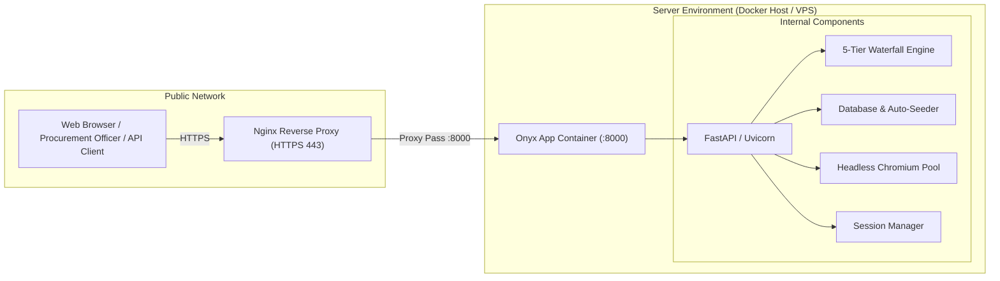

# Self-Hosting Guide

This guide covers running Onyx on your own infrastructure — locally, with Docker, or on a cloud VPS.

---

## 🏗️ Deployment Architecture



---

## Option 1: Docker (Recommended)

Docker is the easiest way to run Onyx. It bundles Python 3.11+, Playwright, Chromium, and all required procurement & scraping dependencies.

### Prerequisites
- [Docker](https://docs.docker.com/get-docker/)
- [Docker Compose](https://docs.docker.com/compose/install/)

### Steps

```bash
# 1. Clone the repo
git clone https://github.com/Tejas3479/onyx.git
cd onyx

# 2. Start the stack
API_KEYS=your-secret-key docker-compose up -d

# 3. Verify it's running
curl http://localhost:8000/api/health
# → {"status":"ok"}
```

Access the web interfaces:
- **Price Benchmark Console:** `http://localhost:8000/benchmark.html`
- **Department LPP Upload:** `http://localhost:8000/upload_history.html`
- **Scraper / Crawler Dashboard:** `http://localhost:8000/`
- **API Swagger Docs:** `http://localhost:8000/docs`

---

## Option 2: Local Python

### Prerequisites
- Python 3.11+
- pip

### Steps

```bash
# 1. Clone
git clone https://github.com/Tejas3479/onyx.git
cd onyx

# 2. Create virtual environment
python -m venv .venv

# Windows
.venv\Scripts\activate

# Linux / Mac
# source .venv/bin/activate

# 3. Install dependencies
pip install -r requirements.txt

# 4. Install Playwright browser
playwright install chromium
# Linux only:
# playwright install-deps chromium

# 5. Set environment variables and run the API
# Windows PowerShell:
$env:API_KEYS = "your-secret-key"
# Linux/Mac:
# export API_KEYS="your-secret-key"

# 6. Launch the server (reference data seeds automatically on first run)
uvicorn app:app --host 0.0.0.0 --port 8000 --reload
```

---

## Option 3: VPS / Cloud VM (Ubuntu 22.04 / 24.04)

### Recommended specs
- 2 CPU, 4 GB RAM minimum for production workloads (Playwright & parallel multi-source querying)

### Setup

```bash
# Install Python 3.11 and Redis
sudo apt update
sudo apt install -y python3.11 python3.11-venv python3-pip git redis-server

# Clone and install
git clone https://github.com/Tejas3479/onyx.git
cd onyx
python3.11 -m venv .venv
source .venv/bin/activate
pip install -r requirements.txt
playwright install chromium
playwright install-deps chromium

# Run API with systemd (persistent)
sudo tee /etc/systemd/system/onyx-api.service << EOF
[Unit]
Description=Onyx Procurement & Scraping API
After=network.target

[Service]
Type=simple
User=$USER
WorkingDirectory=$PWD
Environment=API_KEYS=your-secret-key
Environment=MAX_PLAYWRIGHT_INSTANCES=3
ExecStart=$PWD/.venv/bin/uvicorn app:app --host 0.0.0.0 --port 8000
Restart=on-failure

[Install]
WantedBy=multi-user.target
EOF

# Run Background Worker with systemd (optional, for batch crawls)
sudo tee /etc/systemd/system/onyx-worker.service << EOF
[Unit]
Description=Onyx Background Worker
After=network.target redis-server.service

[Service]
Type=simple
User=$USER
WorkingDirectory=$PWD
Environment=API_KEYS=your-secret-key
ExecStart=$PWD/.venv/bin/arq worker.WorkerSettings
Restart=on-failure

[Install]
WantedBy=multi-user.target
EOF

sudo systemctl daemon-reload
sudo systemctl enable onyx-api onyx-worker
sudo systemctl start onyx-api onyx-worker
```

---

## Environment Variables Reference

| Variable | Default | Description |
|---|---|---|
| `API_KEYS` | *(required)* | Comma-separated API keys, e.g. `key1,key2` |
| `JWT_SECRET_KEY` | *(required)* | Secret key used for signing authentication JWT tokens (must be set in env) |
| `JWT_EXPIRE_MINUTES` | `480` (8 hours) | Token validity duration |
| `RATE_LIMIT_PER_MINUTE` | `60` | Max requests per minute per IP / API key (set to `0` to disable) |
| `MAX_PLAYWRIGHT_INSTANCES` | `3` | Max concurrent headless browser instances |
| `SESSION_TTL_MINUTES` | `30` | How long an idle browser session lives before cleanup |
| `MAX_SESSIONS` | `100` | Total max concurrent persistent sessions |
| `CORS_ORIGINS` | `*` | Comma-separated allowed origins, e.g. `https://myapp.com` |
| `DISABLE_SSRF_CHECK` | `false` | Allow requests to private IPs (⚠️ dev only) |

---

## Security Considerations

### API Keys & JWT Secrets
- In production, configure a cryptographic random string for `JWT_SECRET_KEY`:
  ```bash
  python -c "import secrets; print(secrets.token_hex(32))"
  ```
- Store secrets using environment files or cloud secret managers (AWS Secrets Manager, HashiCorp Vault).

### SSRF Protection
- Onyx inspects target URLs with asynchronous DNS resolution before executing any fetch.
- Private IP spaces (`10.0.0.0/8`, `172.16.0.0/12`, `192.168.0.0/16`, `127.0.0.0/8`, `169.254.0.0/16`) are blocked by default.
